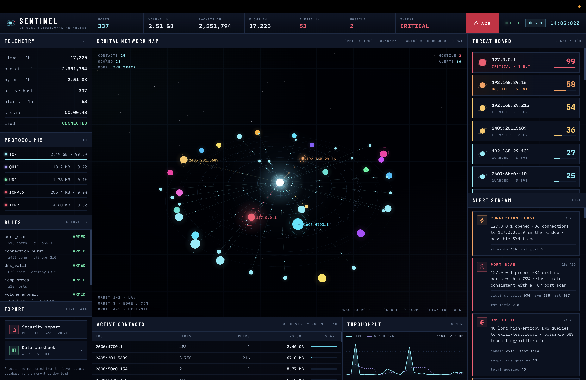

# SENTINEL — Network Traffic Analyzer

A real-time network traffic analyzer that captures packets, detects suspicious activity with **calibrated** thresholds, and presents it through a live security-operations dashboard with exportable reports.

> Cyber Security Capstone Project · SkillOrbit Internship
> N. Ravi Sasank · B.Tech CSE (Cyber Security) · SRM University, AP



---

## Highlights

| | |
|---|---|
| **71 → 0** | False positives on normal traffic after root-cause analysis and recalibration |
| **11,425** | Real flows analysed to derive every detection threshold |
| **714K** | Packets processed under sustained load with zero crashes |
| **9 / 9** | Unit tests passing |
| **< 15 ms** | Response time on all nine API endpoints |

---

## What it does

- **Captures** IPv4 and IPv6 traffic with Scapy, extracting TLS SNI and DNS query names
- **Aggregates** packets into 10-second flow records, keeping storage bounded indefinitely
- **Detects** port scans, SYN floods, DNS tunnelling and ICMP sweeps with signature rules
- **Learns** each host's normal behaviour and flags statistical anomalies (EWMA, 3.5σ)
- **Explains** every alert in plain English, with the evidence that triggered it
- **Maps** every detection to a MITRE ATT&CK technique
- **Scores** hosts on a 0–100 threat scale that decays over time
- **Alerts** audibly for critical detections, repeating until acknowledged
- **Reports** as a formal PDF assessment and a 9-sheet Excel workbook, on demand

---

## Architecture

Three isolated processes share one SQLite database in WAL mode:

```
┌─────────────────┐   ┌─────────────────┐   ┌─────────────────┐
│ Capture service │   │   API server    │   │    Dashboard    │
│ Scapy · detect  │   │ FastAPI · WS    │   │ React · Three.js│
│ (capture access)│   │ (unprivileged)  │   │ (unprivileged)  │
└────────┬────────┘   └────────┬────────┘   └────────┬────────┘
         │ writes              │ reads               │ HTTP + WebSocket
         └──────────► SQLite (WAL) ◄───────┘ ◄────────┘
```

The privileged sniffer never shares a process with the web server, so a flaw in the web layer cannot reach packet capture, and either side restarts independently.

---

## Detection methodology

Every threshold sits above the **99th percentile** of observed normal traffic:

| Rule | Threshold | Observed normal (p99) | ATT&CK |
|---|---|---|---|
| `port_scan` | 15 distinct ports, >50% refused | 3 ports/min | T1046 |
| `connection_burst` | 421 connections to one port | 210/min | T1498.001 |
| `dns_exfil` | 30+ char label, entropy ≥ 3.5 | entropy ≈ 1.9 | T1048.003 |
| `icmp_sweep` | 10 distinct destinations | 3 hosts/min | T1018 |
| `volume_anomaly` | z ≥ 3.5σ, floor 50 KB | per-host EWMA | T1030 |

---

## Tech stack

**Capture** Python · Scapy  **Processing** Pandas  **Storage** SQLite (WAL)
**API** FastAPI · Uvicorn · WebSocket  **Dashboard** React · Vite · Tailwind CSS
**3D map** Three.js  **Reports** ReportLab · openpyxl  **Tests** pytest

---

## Running it

**Requirements:** macOS or Linux, Python 3.11+, Node 18+. On macOS, install Wireshark
(`brew install --cask wireshark`) to get the ChmodBPF helper for packet-capture permissions.

```bash
git clone https://github.com/ravi-sasank/network-traffic-analyzer.git
cd network-traffic-analyzer

python3 -m venv venv && source venv/bin/activate
pip install -r requirements.txt
cd frontend && npm install && cd ..
```

Start all three processes with the launcher:

```bash
./scripts/sentinel.command                 # live capture on en0
NTA_IFACE=lo0 ./scripts/sentinel.command   # loopback, for the attack simulator
```

Then open **http://localhost:5173**. API docs are at **http://localhost:8000/docs**.

### Demonstrating detection

With capture running on `lo0`, fire the simulator from another terminal:

```bash
python tools/attack_sim.py all
```

It generates a port scan, SYN flood, DNS-exfiltration pattern and traffic spike against **loopback only**.

### Tests

```bash
pytest tests/ -v
```

---

## Project structure

```
backend/
  capture/      packet parsing and flow aggregation
  detection/    rules, baseline, severity, suppression, threat scoring, engine
  storage/      SQLite schema and queries
  api/          FastAPI app and report routes
  reports/      PDF and Excel generators
frontend/src/   React dashboard and 3D orbital map
tools/          attack simulator, threshold calibration, soak monitor
tests/          detection rule unit tests
docs/           screenshots, report, presentation
```

---

## Scope and ethics

SENTINEL is a **passive, defensive** monitoring tool. All traffic was captured on networks owned or administered by the author. No penetration testing, exploitation or unauthorised access was performed. Attack signatures used for validation were generated locally against the loopback interface.

Encrypted payloads are not decrypted; analysis relies on flow metadata, TLS SNI and DNS records.
